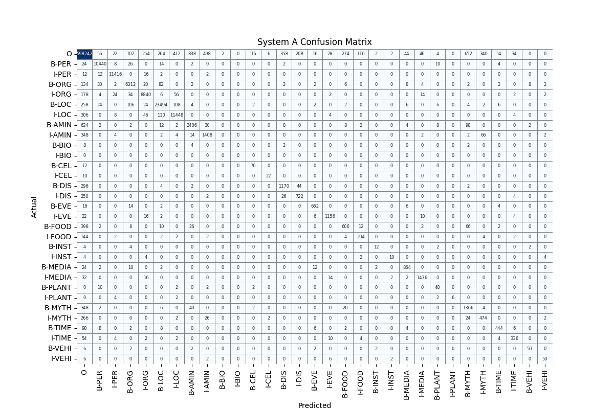
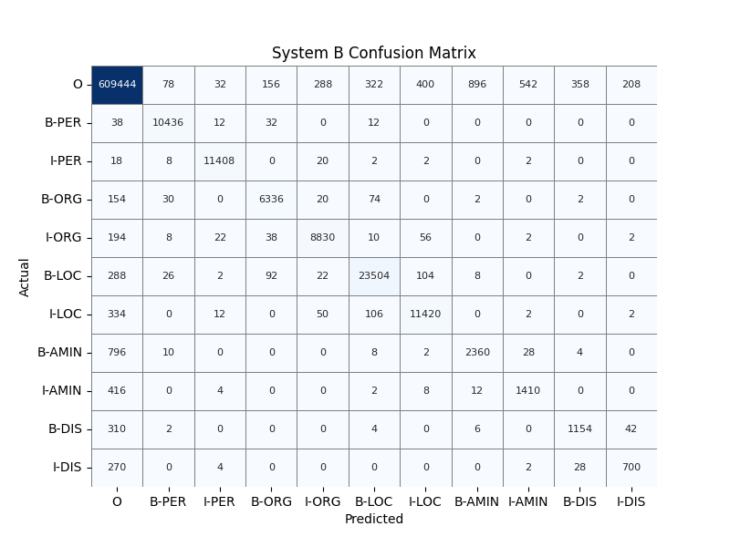
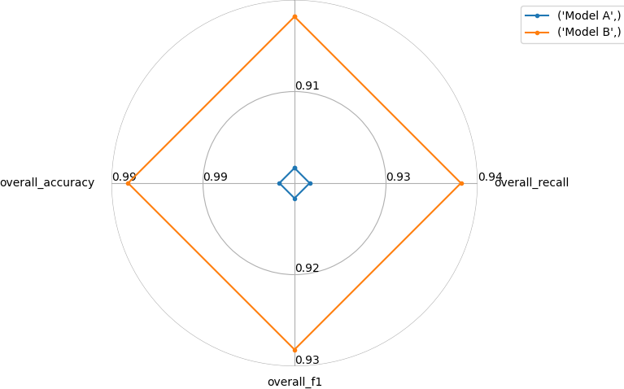
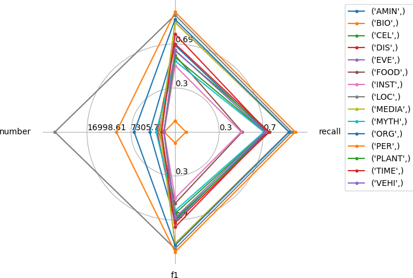
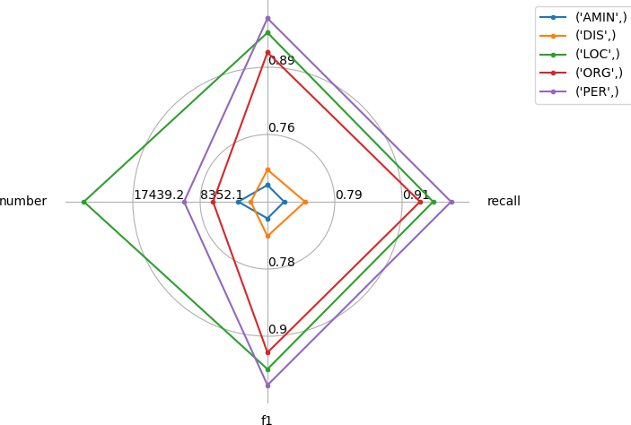

## Named Entity Recognition (NER) using BART and MultiNERD

This project implemented a NER model for English using a reduced BERT-derived model prajjwal1/bert-small and the Babelscape/MultiNERD NER dataset. Two fine-tuned NER models (system A & B) are created using an English-only extraction of MultiNERD. System A includes all MultiNERD NER classes (PER, ORG, LOC, AMIN, BIO, CEL, DIS, EVE, FOOD, INST, MEDIA, PLANT, MYTH, TIME, VEHI and O), while System B uses the class subset (PER, ORG, LOC, DIS, AMIN and O) and sets all remaining tags to O.

| NER Tag | Description            |
|:--------|:-----------------------|
| O       | Outside any entity     |
| PER     | Person                 |
| ORG     | Organisation           |
| LOC     | Location               |
| AMIN    | Animals                |
| BIO     | Biological organisms   |
| CEL     | Celestial objects      |
| DIS     | Diseases               |
| EVE     | Events                 |
| FOOD    | Foods and Drinks       |
| INST    | Instruments            |
| MEDIA   | Titles, characters     |
| PLANT   | Plants                 |
| MYTH    | Mythological           |
| TIME    | Time points, intervals |
| VEHI    | Vehicles               |

### Installation

PyTorch is used and the required Python 3 packages are in requirements.txt

[prajjwal1/bert-small](https://huggingface.co/prajjwal1/bert-small) and [Babelscape/MultiNERD](https://huggingface.co/datasets/Babelscape/multinerd) are loaded automatically from HuggingFace.

### Usage

Provided scripts are ner_model.py to generate a model and compare_models.py to visualise the results. For the selected system type (A or B) and number of epochs (defaulting to 1), ner_model.py writes out metrics in a .json file and confusion matrix in a .csv file with a specified result file basename, which defaults to "result".

`usage: python ner_model.py -[hAB] -e <epochs> -r <result file basename>`
    
    
compare_models.py reads in the results files for both systems A and B. It plots confusion matrices for both systems and radar plots for comparison. 
    
`usage: python compare_models.py <model A basename> <model B basename>`

### Findings from training experiments

The [seqeval](https://huggingface.co/spaces/evaluate-metric/seqeval) framework was used for metrics on sequence labeling evaluation. It produced overall accuracy, precision, recall and f1 as well as precision, recall f1 and number of occurences for each NER tag. There was a large variation in tag frequencies in decending order: LOC, PER, ORG, AMIN, MYTH, DIS, FOOD, MEDIA, EVE, TIME, CEL, PLANT, VEHI, INST, BIO. System A used all the classes while system B used the subset (LOC, PER, ORG, AMIN, DIS). The tags in the subset all had the highest occurrences in the dataset except for DIS, which had slightly less than MYTH. While the recognition of PER had the highest accuracy in both systems, generally the accuracy was highly dependent on the number of occurences of class tags. The poorest performing class was BIO, which was not recognized at all in the training set. Confusion matrices were plotted and radar plots were generated for system A, system B and a comparison of system them. These are in the results directory and below for 2 epochs. One limitation was the choice of BERT-small for the pre-tuned model, which was selected partially because it could be fine-tuned with 4GB of VRAM on a desktop GPU. 

---

### Confusion Matrices

---

### Radar Plots
##### Note: radar_plot does not render the top label, which appears to be a bug. It is ___precision___ on all plots.

#### Radar plot comparing systems A and B

#### Radar plot of system A

#### Radar plot of system B

---

### Reference

[MultiNERD: A Multilingual, Multi-Genre and Fine-Grained Dataset for Named Entity Recognition (and Disambiguation)](https://aclanthology.org/2022.findings-naacl.60) (Tedeschi & Navigli, Findings 2022)

### Acknowledgements
RISE Research Institutes of Sweden is acknowledged for providing this task.
